# Task Manager
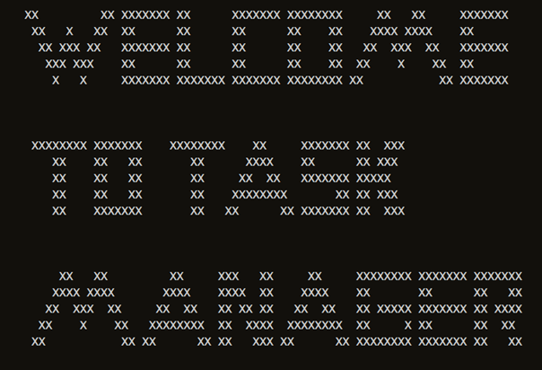

## Introduction
This project was created to help myself and others increase in productivity by being able to manage and add daily tasks. 
 

### Site Goals
* Provide a simple application that allows the user to add tasks to a spreadsheet and manage those tasks which are divided into the following filters when viewing: all tasks, the last task set, complete tasks, incomplete tasks, due tasks, and past-due tasks.
 

### User stories
* As a User, I would like to be able to add a task to my list of tasks. 
* As a User, I would like to be able to manage my tasks so that I can easily keep track of all the tasks I have and edit / remove as neccessary.
* As a User, I would like to be able to manage my tasks so that I can easily keep track of the last task I set so I can edit / remove as neccessary.
* As a User, I would like to be able to manage my tasks so that I can easily keep track of the complete tasks I have and edit / remove as neccessary.
* As a User, I would like to be able to manage my tasks so that I can easily keep track of the incomplete tasks I have and edit / remove as neccessary.
* As a User, I would like to be able to manage my tasks so that I can easily keep track of what tasks I have due and edit / remove as neccessary.
* As a User, I would like to be able to manage my tasks so that I can easily keep track of what tasks I have past due and edit / remove as neccessary.
* As a User, I would like to be able to return to the main menu without having to restart the application.
 

### Flowchart
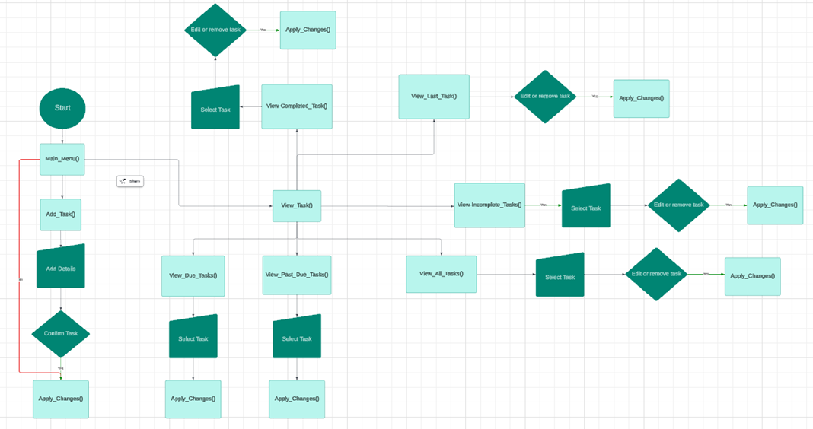
 

## Features

### Existing Features

#### Main menu
* The main menu displays two options to the user to select either option 1, add a task or option 2, view tasks.
    * If the user selects option 1, the task manager runs the add task function in which the user is prompted to enter task content and the date

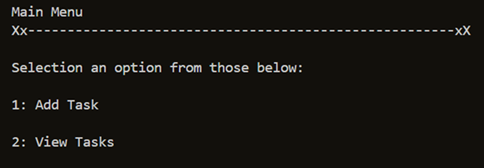

 

#### Add Task
* The task manager's add task function prompts the user to enter the content and date for the task.
    * The function validates if the content and date entered are of the correct type and format.

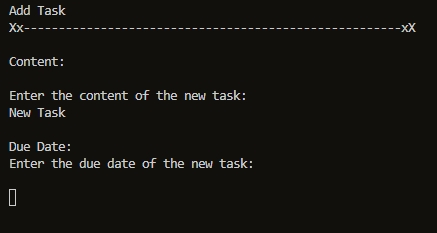

 

- #### Confirmation in adding the task
    - Once the user has entered the correct content and date of the task, the user is asked if they would like to confirm the details.
    - The function validates the input so that only 1 and 2 can be entered for yes or no.
    - If they enter 1 the changes are confirmed and the changes are pushed to the spreadsheet and if the input is 2 the changes are abandoned and the main menu is displayed.
 

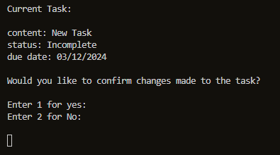

 

* #### View Task Menu
    * The view task menu is displayed when the user selects the view tasks option on the main menu.
    * It displays 7 options to the user with each each option carrying out their corresponding functionality as displayed in their names.
    * The input is validated so that the user can only select the correct input.

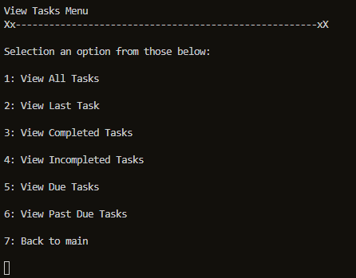

 

* #### View All Tasks
    * The view all task function displays all tasks in the spreasheet in order of chronological order according to their date.
    * The input is validated so that the user can only enter the correct value.

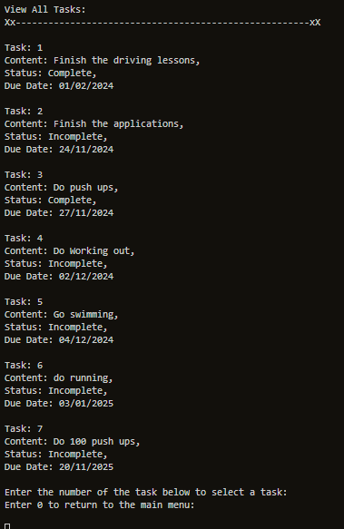

 

- #### Task is selected
    - Once the task has been selected, the user is given the option to either modify the task, remove the task or return to the main menu.
    - The input is validated so that the can only enter the correct value.

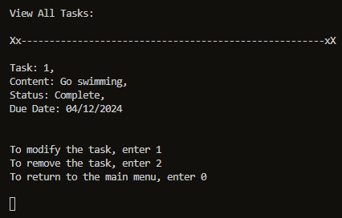

 

* #### View Last Task
    * The view last task function displays the last task in uploaded to the speadsheet.
    * The user is given the option to modify the task, remove the task and to return back to the main menu.

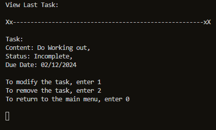

 

* #### View Complete Tasks
    * The view completed task function displays all completed tasks in the spreasheet in order of chronological order according to their date.
    * The input is validated so that the user can only enter the correct value.

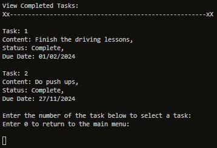

 

- #### Task is selected
    - Once the task has been selected, the user is given the option to either modify the task, remove the task or return to the main menu.
    - The input is validated so that the can only enter the correct value.

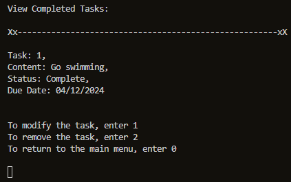

* #### View Incomplete Tasks
    * The view incompleted task function displays all incomplete tasks in the spreasheet in order of chronological order according to their date.
    * The input is validated so that the user can only enter the correct value.

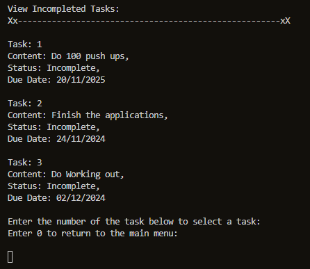

 

- #### Task is selected
    - Once the task has been selected, the user is given the option to either modify the task, remove the task or return to the main menu.
    - The input is validated so that the can only enter the correct value.

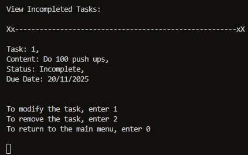

* #### View Due Tasks
    * The view due task function displays all due tasks in the spreasheet in order of chronological order according to their date.
    * The input is validated so that the user can only enter the correct value.

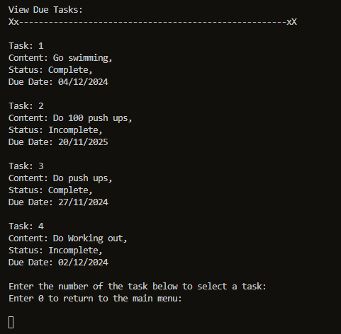

 

- #### Task is selected
    - Once the task has been selected, the user is given the option to either modify the task, remove the task or return to the main menu.
    - The input is validated so that the can only enter the correct value.

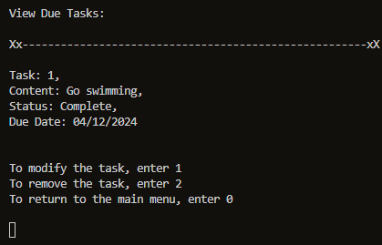

* #### View Past Due Tasks
    * The view past due task function displays all past due tasks in the spreasheet in order of chronological order according to their date.
    * The input is validated so that the user can only enter the correct value.

 

- #### Task is selected
    - Once the task has been selected, the user is given the option to either modify the task, remove the task or return to the main menu.
    - The input is validated so that the can only enter the correct value.

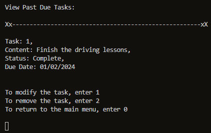

### Features left to implement
* Additional features to implement would include an attribute that says a task is either expired or not expired making it easier for the user to tell the difference.
 

## Technologies used

### Language Used

* [Python3](https://en.wikipedia.org/wiki/Python_(programming_language))

### Frameworks, Libraries and Programs Used

* [GitPod](https://www.gitpod.io/) was used for writing code.

* [GitHub](https://github.com/) was used to store the project after pushing.

* [Heroku](https://id.heroku.com/) was used to deploy the application.

* [CI Python Linter](https://pep8ci.herokuapp.com/) was used to validate the Python code.
 
* [lucidchart](https://www.lucidchart.com/) was used to create the programs flowchart.

 

## Testing

### Validator Testing
* #### The [CI Python Linter](https://pep8ci.herokuapp.com/#) was used continuosly during the development proces to validate the Python code.

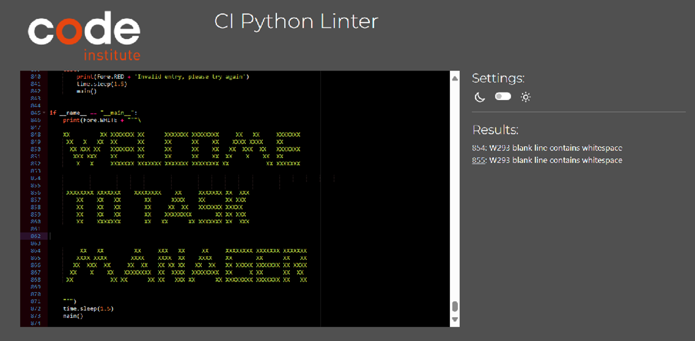

 

### Manual Testing
<table>
    <tr>
        <th>Feature</th>
        <th>Outcome</th>
        <th>Example</th>
        <th>Pass/Fail</th>
    </tr>
    <tr>
        <td>Main Menu</td>
        <td>Inputs are validated so that only 1 and 2 are excepted as inputs</td>
        <td>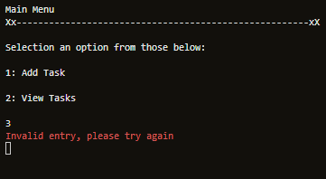</td>
        <td>Pass</td>
    </tr>
    <tr>
        <td>Add Task</td>
        <td>Validate the inputs so that task content only contains alphanumeric letters</td>
        <td>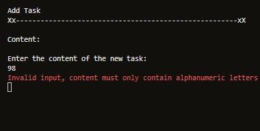</td>
        <td>Pass</td>
    </tr>
    <tr>
        <td>Add Task</td>
        <td>Validate the inputs so that task content cannot be empty</td>
        <td>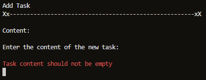</td>
        <td>Pass</td>
    </tr>
    <tr>
        <td>Add Task</td>
        <td>Validate the inputs so that only the correct format is accepted for the date</td>
        <td>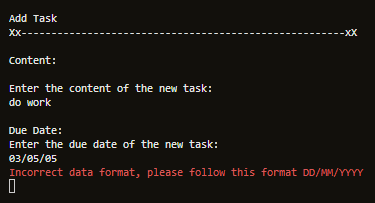</td>
        <td>Pass</td>
    </tr>
    <tr>
        <td>Add Task Confirmation screen</td>
        <td>Inputs are validated so that only 1 and 2 are excepted as inputs</td>
        <td>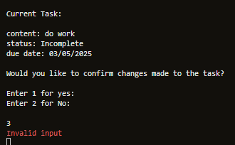</td>
        <td>Pass</td>
    </tr>
    <tr>
        <td>View Task Menu</td>
        <td>Inputs are validated so that only a value corresponding to a function or 0 to return to the main menu is accepted</td>
        <td>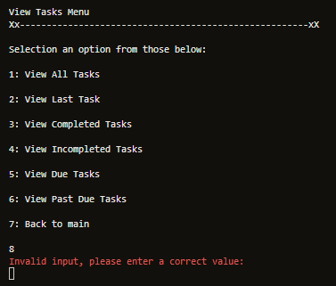</td>
        <td>Pass</td>
    </tr>
    <tr>
        <td >View all tasks screen</td>
        <td>Inputs are validated so that only a value corresponding to a task or 0 to return to the main menu is accepted</td>
        <td>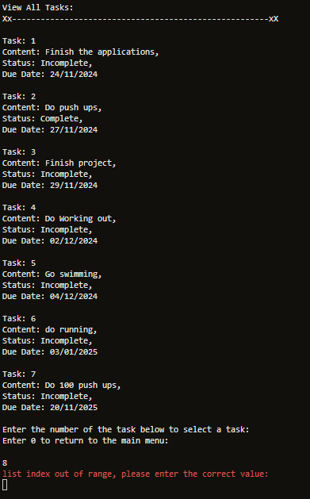</td>
        <td>Pass</td>
    </tr>
    <tr>
        <td>View All Task selected task screen</td>
        <td>Validates the inputs to ensure only numbers from 0-2 are accepted</td>
        <td>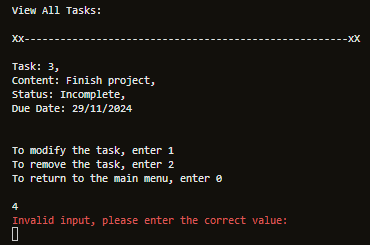</td>
        <td>Pass</td>
    </tr>
    <tr>
        <td>View Last tasks screen</td>
        <td>Inputs are validated so that only a value corresponding to a task or 0 to return to the main menu is accepted</td>
        <td>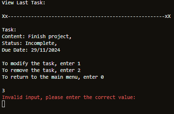</td>
        <td>Pass</td>
    </tr>
    <tr>
        <td>View Last tasks selected task screen</td>
        <td>Validates the inputs to ensure only numbers from 0-2 are accepted</td>
        <td>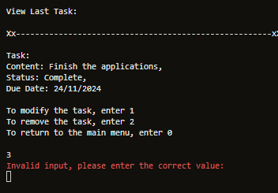</td>
        <td>Pass</td>
    </tr>
    <tr>
        <td>View complete tasks screen</td>
        <td>Inputs are validated so that only a value corresponding to a task or 0 to return to the main menu is accepted</td>
        <td>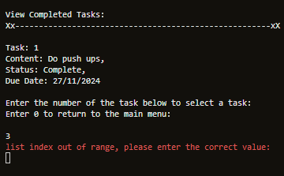</td>
        <td>Pass</td>
    </tr>
    <tr>
        <td>View complete tasks selected task screen</td>
        <td>Validates the inputs to ensure only numbers from 0-2 are accepted</td>
        <td>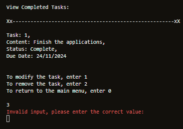</td>
        <td>Pass</td>
    </tr>
    <tr>
        <td>View Incomplete tasks screen</td>
        <td>Inputs are validated so that only a value corresponding to a task or 0 to return to the main menu is accepted</td>
        <td>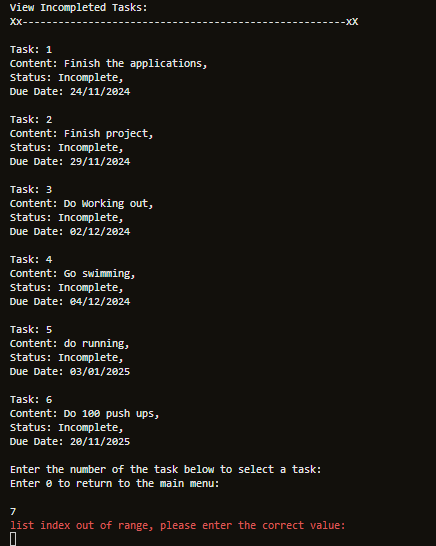</td>
        <td>Pass</td>
    </tr>
    <tr>
        <td>View incomplete tasks selected task screen</td>
        <td>Validates the inputs to ensure only numbers from 0-2 are accepted</td>
        <td>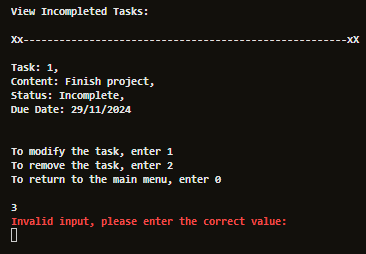</td>
        <td>Pass</td>
    </tr>
    <tr>
        <td>View due task screen</td>
        <td>Inputs are validated so that only a value corresponding to a task or 0 to return to the main menu is accepted</td>
        <td>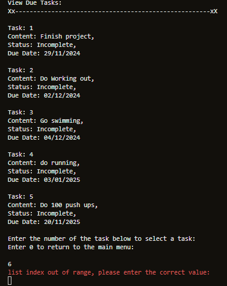</td>
        <td>Pass</td>
    </tr>
    <tr>
        <td>View due tasks selected task screen</td>
        <td>Validates the inputs to ensure only numbers from 0-2 are accepted</td>
        <td>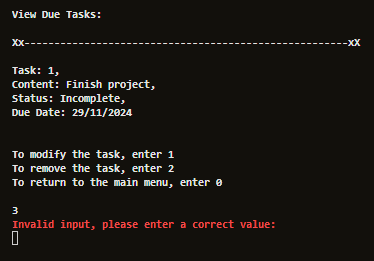</td>
        <td>Pass</td>
    </tr>
    <tr>
        <td>View past due task screen</td>
        <td>Inputs are validated so that only a value corresponding to a task or 0 to return to the main menu is accepted</td>
        <td>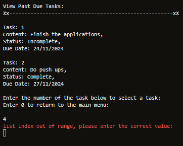</td>
        <td>Pass</td>
    </tr>
    <tr>
        <td>View past due tasks selected task screen</td>
        <td>Validates the inputs to ensure only numbers from 0-2 are accepted</td>
        <td>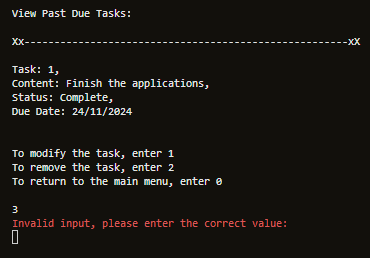</td>
        <td>Pass</td>
    </tr>
    <tr>
        <td>Modify task screen</td>
        <td>Validates the inputs to ensure only numbers from 1-5 are accepted</td>
        <td>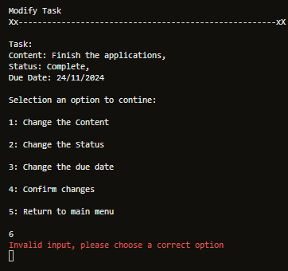</td>
        <td>Pass</td>
    </tr>
    <tr>
        <td>Modify task screen - Change the content</td>
        <td>Inputs are validated so that only alphanumeric letters are accepted</td>
        <td>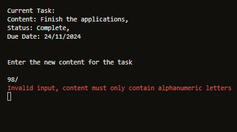</td>
        <td>Pass</td>
    </tr>
    <tr>
        <td>Modify task screen - Change the content</td>
        <td>Inputs are validated so that empty fields are not accepted as inputs</td>
        <td>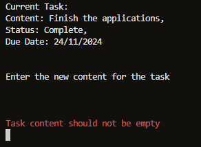</td>
        <td>Pass</td>
    </tr>
    <tr>
        <td>Modify task screen - Change the status</td>
        <td>Inputs are validated so that only 1 and 2 are excepted as inputs</td>
        <td>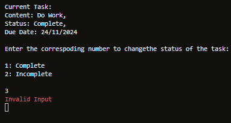</td>
        <td>Pass</td>
    </tr>
    <tr>
        <td>Modify task screen - Change the due date</td>
        <td>Validate the input so that only the correct format is accepted for the date and that the date is not in the past</td>
        <td>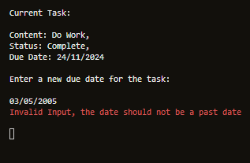</td>
        <td>Pass</td>
    </tr>
    <tr>
        <td>Modify task screen - Confirm the changes</td>
        <td>Inputs are validated so that only 1 and 2 are excepted as inputs</td>
        <td>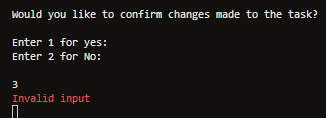</td>
        <td>Pass</td>
    </tr>
    <tr>
        <td>Remove task confirmation screen</td>
        <td>Inputs are validated so that only 1 and 2 are excepted as inputs</td>
        <td>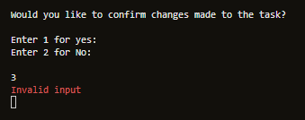</td>
        <td>Pass</td>
    </tr>
</table>

 

## Deployment

