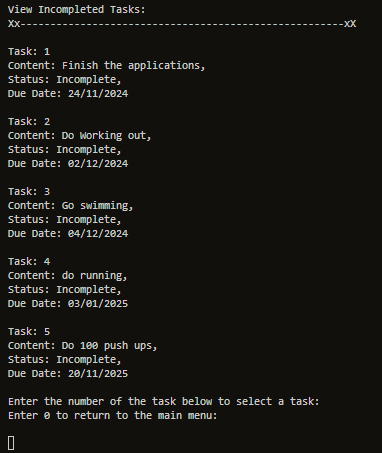
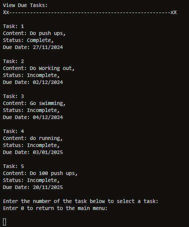
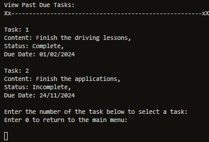

# Task Manager

Visit the deployed application [here](https://taskmanagerpp3-8955eacf9ce5.herokuapp.com/)

## Introduction
This project was created to help myself and others increase in productivity by being able to manage and add daily tasks. 
 

### Site Goals
* Provide a simple application that allows the user to add tasks to a spreadsheet and manage those tasks which are divided into the following filters when viewing: all tasks, the last task set, complete tasks, incomplete tasks, due tasks, and past-due tasks.
 

### User stories
* As a User, I would like to be able to add a task to my list of tasks. 
* As a User, I would like to be able to manage my tasks so that I can easily keep track of all the tasks I have and edit / remove as neccessary.
* As a User, I would like to be able to manage my tasks so that I can easily keep track of the last task I set so I can edit / remove as neccessary.
* As a User, I would like to be able to manage my tasks so that I can easily keep track of the complete tasks I have and edit / remove as neccessary.
* As a User, I would like to be able to manage my tasks so that I can easily keep track of the incomplete tasks I have and edit / remove as neccessary.
* As a User, I would like to be able to manage my tasks so that I can easily keep track of what tasks I have due and edit / remove as neccessary.
* As a User, I would like to be able to manage my tasks so that I can easily keep track of what tasks I have past due and edit / remove as neccessary.
* As a User, I would like to be able to return to the main menu without having to restart the application.
 

### Flowchart

 

## Features

### Existing Features

#### Main menu
* The main menu displays two options for the user to select: Option 1 - Add a Task, or Option 2 - View Tasks.
    * If the user selects Option 1, the task manager runs the "Add Task" function, prompting the user to enter task content and the date.
    * If the user selects Option 2, the menu for filtering the tasks for viewing is displayed.

 

#### Add Task
* The task manager's "Add Task" function prompts the user to enter the content and date for the task.
    * The function validates whether the content and date entered are in the correct format and type.

 

- #### Confirmation in adding the task
    - Once the user has entered the correct content and date of the task, they are asked to confirm the details.
        - The function validates the input so that only 1 (yes) or 2 (no) can be entered.
        - If the user enters 1, the task is confirmed and saved to the spreadsheet. If the user enters 2, the changes are abandoned, and the main menu is displayed.
 

 

* #### View Task Menu
    * The "View Task" menu is displayed when the user selects the View Tasks option on the main menu.
        * It presents 7 options to the user, each corresponding to a specific functionality, as described by their names.
        * The input is validated so that the user can only select a valid option.

 

* #### View All Tasks
    * The "View All Tasks" function displays all tasks in the spreadsheet in chronological order based on their dates.
        * The input is validated to ensure the user enters a correct value.

 

- #### Task is selected
    - Once a task is selected, the user is given options to either modify the task, remove the task, or return to the main menu.
        - The input is validated to ensure the user enters a correct value.

 

* #### View Last Task
    * The "View Last Task" function displays the last task uploaded to the spreadsheet.
        * The user is given options to modify the task, remove the task, or return to the main menu.

 

* #### View Completed Tasks
    * The "View Completed Tasks" function displays all completed tasks in the spreadsheet in chronological order based on their dates.
        * The input is validated to ensure the user enters a correct value.

 

- #### Task is selected
    - Once a task is selected, the user is given options to either modify the task, remove the task, or return to the main menu.
        - The input is validated to ensure the user enters a correct value.

* #### View Incomplete Tasks
    * The "View Incomplete Tasks" function displays all incomplete tasks in the spreadsheet in chronological order based on their dates.
    * The input is validated to ensure the user enters a correct value.

 

- #### Task is selected
    - Once a task is selected, the user is given options to either modify the task, remove the task, or return to the main menu.
        - The input is validated to ensure the user enters a correct value.

* #### View Due Tasks
    * The "View Due Tasks" function displays all tasks that are due, sorted in chronological order based on their dates.
        * The input is validated to ensure the user enters a correct value.

 

- #### Task is selected
    - Once a task is selected, the user is given options to either modify the task, remove the task, or return to the main menu.
        - The input is validated to ensure the user enters a correct value.

* #### View Past Due Tasks
    * The "View Past Due Tasks" function displays all past-due tasks in the spreadsheet, sorted in chronological order based on their dates.
        * The input is validated to ensure the user enters a correct value.

 

- #### Task is selected
    - Once a task is selected, the user is given options to either modify the task, remove the task, or return to the main menu.
        - The input is validated to ensure the user enters a correct value.

### Features left to implement
* Additional features to implement include an attribute that indicates whether a task is expired or not, making it easier for users to differentiate tasks.
 

## Technologies used

### Language Used

* [Python3](https://en.wikipedia.org/wiki/Python_(programming_language))

### Frameworks, Libraries and Programs Used

* [GitPod](https://www.gitpod.io/) was used for writing code.

* [GitHub](https://github.com/) was used to store the project after pushing.

* [Heroku](https://id.heroku.com/) was used to deploy the application.

* [CI Python Linter](https://pep8ci.herokuapp.com/) was used to validate the Python code.
 
* [lucidchart](https://www.lucidchart.com/) was used to create the programs flowchart.

 

## Testing

### Validator Testing
* #### The [CI Python Linter](https://pep8ci.herokuapp.com/#) was used continuosly during the development proces to validate the Python code.

 

### Manual Testing
<table>
    <tr>
        <th>Feature</th>
        <th>Outcome</th>
        <th>Example</th>
        <th>Pass/Fail</th>
    </tr>
    <tr>
        <td>Main Menu</td>
        <td>Inputs are validated so that only 1 and 2 are excepted as inputs</td>
        <td></td>
        <td>Pass</td>
    </tr>
    <tr>
        <td>Add Task</td>
        <td>Validate the inputs so that task content only contains alphanumeric letters</td>
        <td></td>
        <td>Pass</td>
    </tr>
    <tr>
        <td>Add Task</td>
        <td>Validate the inputs so that task content cannot be empty</td>
        <td></td>
        <td>Pass</td>
    </tr>
    <tr>
        <td>Add Task</td>
        <td>Validate the inputs so that only the correct format is accepted for the date</td>
        <td></td>
        <td>Pass</td>
    </tr>
    <tr>
        <td>Add Task Confirmation screen</td>
        <td>Inputs are validated so that only 1 and 2 are excepted as inputs</td>
        <td></td>
        <td>Pass</td>
    </tr>
    <tr>
        <td>View Task Menu</td>
        <td>Inputs are validated so that only a value corresponding to a function or 0 to return to the main menu is accepted</td>
        <td></td>
        <td>Pass</td>
    </tr>
    <tr>
        <td >View all tasks screen</td>
        <td>Inputs are validated so that only a value corresponding to a task or 0 to return to the main menu is accepted</td>
        <td></td>
        <td>Pass</td>
    </tr>
    <tr>
        <td>View All Task selected task screen</td>
        <td>Validates the inputs to ensure only numbers from 0-2 are accepted</td>
        <td></td>
        <td>Pass</td>
    </tr>
    <tr>
        <td>View Last tasks screen</td>
        <td>Inputs are validated so that only a value corresponding to a task or 0 to return to the main menu is accepted</td>
        <td></td>
        <td>Pass</td>
    </tr>
    <tr>
        <td>View Last tasks selected task screen</td>
        <td>Validates the inputs to ensure only numbers from 0-2 are accepted</td>
        <td></td>
        <td>Pass</td>
    </tr>
    <tr>
        <td>View complete tasks screen</td>
        <td>Inputs are validated so that only a value corresponding to a task or 0 to return to the main menu is accepted</td>
        <td></td>
        <td>Pass</td>
    </tr>
    <tr>
        <td>View complete tasks selected task screen</td>
        <td>Validates the inputs to ensure only numbers from 0-2 are accepted</td>
        <td></td>
        <td>Pass</td>
    </tr>
    <tr>
        <td>View Incomplete tasks screen</td>
        <td>Inputs are validated so that only a value corresponding to a task or 0 to return to the main menu is accepted</td>
        <td></td>
        <td>Pass</td>
    </tr>
    <tr>
        <td>View incomplete tasks selected task screen</td>
        <td>Validates the inputs to ensure only numbers from 0-2 are accepted</td>
        <td></td>
        <td>Pass</td>
    </tr>
    <tr>
        <td>View due task screen</td>
        <td>Inputs are validated so that only a value corresponding to a task or 0 to return to the main menu is accepted</td>
        <td></td>
        <td>Pass</td>
    </tr>
    <tr>
        <td>View due tasks selected task screen</td>
        <td>Validates the inputs to ensure only numbers from 0-2 are accepted</td>
        <td></td>
        <td>Pass</td>
    </tr>
    <tr>
        <td>View past due task screen</td>
        <td>Inputs are validated so that only a value corresponding to a task or 0 to return to the main menu is accepted</td>
        <td></td>
        <td>Pass</td>
    </tr>
    <tr>
        <td>View past due tasks selected task screen</td>
        <td>Validates the inputs to ensure only numbers from 0-2 are accepted</td>
        <td></td>
        <td>Pass</td>
    </tr>
    <tr>
        <td>Modify task screen</td>
        <td>Validates the inputs to ensure only numbers from 1-5 are accepted</td>
        <td></td>
        <td>Pass</td>
    </tr>
    <tr>
        <td>Modify task screen - Change the content</td>
        <td>Inputs are validated so that only alphanumeric letters are accepted</td>
        <td></td>
        <td>Pass</td>
    </tr>
    <tr>
        <td>Modify task screen - Change the content</td>
        <td>Inputs are validated so that empty fields are not accepted as inputs</td>
        <td></td>
        <td>Pass</td>
    </tr>
    <tr>
        <td>Modify task screen - Change the status</td>
        <td>Inputs are validated so that only 1 and 2 are excepted as inputs</td>
        <td></td>
        <td>Pass</td>
    </tr>
    <tr>
        <td>Modify task screen - Change the due date</td>
        <td>Validate the input so that only the correct format is accepted for the date and that the date is not in the past</td>
        <td></td>
        <td>Pass</td>
    </tr>
    <tr>
        <td>Modify task screen - Confirm the changes</td>
        <td>Inputs are validated so that only 1 and 2 are excepted as inputs</td>
        <td></td>
        <td>Pass</td>
    </tr>
    <tr>
        <td>Remove task confirmation screen</td>
        <td>Inputs are validated so that only 1 and 2 are excepted as inputs</td>
        <td></td>
        <td>Pass</td>
    </tr>
</table>

 

## Deployment

### Gitpod Version Control
This site was created using the Gitpod cloud development environment before being pushed through to a dedicated repository on Github.

The following commands were used througout development to push the code through to the Github repo:

- **git add .** - This command was used to add any tracked files to the staging area.
- **git commit -m "Commit message."** - This command was used to create a snapshot of the staged area with a short description.
- **git push** - This command was used to push the committed changes from the current branch to the remote repository on Github.

### Deployment

The finished program was initially hosted within a repository on Github, and then this Github repository was connected with Heroku, the site through which the program is deployed.

***How to Deploy to Heroku***

The steps to deploy to Heroku are as follows:

- Ensure that you have a file in your program file directory called: requirements.txt 
- Ensure that all imported libraries that are used in your program are listed in the requirements.txt file.
    - To add any new libraries, type the following command into the terminal: pip3 freeze > requirements.txt
- To avoid errors, ensure that there is a \n (new line) at the end of every input function in your code.
- Use **git add .** then **git commit -m "Commit message."** and then **git push** to push all latest changes into the relevant repository on Github.
- Go to the [Heroku Website](https://dashboard.heroku.com/) and log in by clicking on the link in the top right corner of the screen.
    - Sign up for a new Heroku account if needed. 
    - Please note you will need to add a payment card before Heroku will allow you to deploy any project. 
    - To do this you will need to click on your account profile in the top right corner and click on Account Settings, then select the Billing tab and follow the instructions to add a credit card. 
- Once logged in, click on the **'New'** drop down menu at the top of your dashboard and select **'Create new app'**
- Choose a name for your app ideally using the same conventions as your project name in your Github repository
- Select the region that you are located in from the options shown
- Ignore the Add to pipeline... button and click on **'Create app'**
- Select the **'Settings'** tab at the top of the screen and scroll to the Config Vars section
- Click on **'Reveal Config Vars'** and if you have a file with confidetial information such as a CREDS.json file type 'CREDS' in the 'key' field and then copy the entire contents of your CREDS.json file and paste it all into the 'Value' field before clicking on **'Add'**.
- Repeat the above process to add a second Config Var and type 'PORT' in the 'Key' field and type '8000' in the 'Value' field before clicking on **'Add'**
- Scroll down to the Buildpacks section and click on **'Add buildpack'**, then select 'Python' from the menu and click on **'Add'**.
- Repeat the above process to add a second buildpack. This time select 'nodejs' from the menu and click on **'Add'**.
- Check that both buildpacks are listed and that Python is positioned on top, with nodejs listed underneath.
- Scroll back to the top of the page and click on the 'Deploy' tab.
- In the Deployment Method section, select Github and confirm that you want to connect to Github.
- In the 'Search for a repository to connect to' type in the name of the repository that you want to deploy and click **'Search'**.
- Click on the **'Connect'** button next to the correct Github repository in the search results
- Scroll down to select whether you would like to deploy automatically (Heroku will build a new app every time you push new updates through to the Github repository), or whether you would like to deploy manually at less regular intervals when you wish to check or test something.
- Click on either **'Enable Automatic Deploys'** to update automatically, or on **'Deploy Branch'** (ensure that the branch selected is 'main') to deploy manually when you want to.
- Heroku will build your app and will then display a 'View' button at the bottom of the screen.
- Click **'View'** to see your deployed project!  

## Credits

### Code

[stack overflow](https://stackoverflow.com/questions/61594765/how-to-use-str-isalpha) - Stack overlow was refered to throughout the development of this project when it came to dealing with errors and shortcuts in validation.

